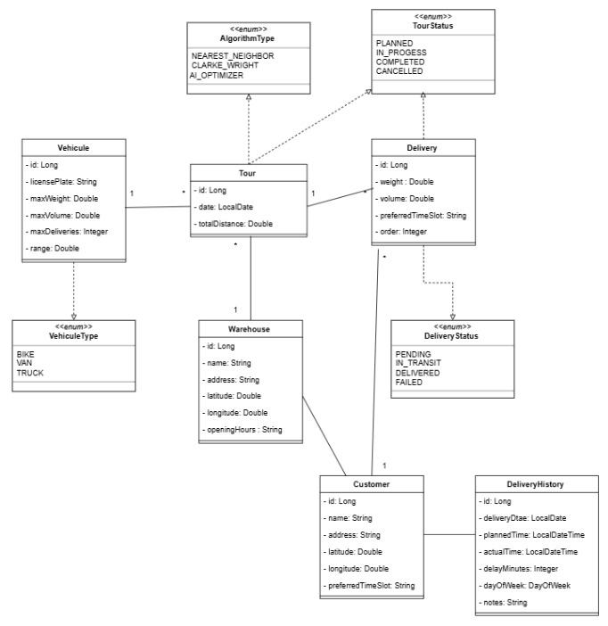

# 🚚 WASALOWAFAR - Système d'Optimisation des Tournées de Livraison Intelligente V2.0

<div align="center">


**Solution intelligente d'optimisation des tournées de livraison avec intégration IA et gestion avancée des données**

</div>

## 🎯 Contexte et Objectif
Ce projet représente l'évolution du système V1 de gestion de tournées de livraison. La version 2.0 intègre des technologies avancées et des capacités d'intelligence artificielle pour optimiser davantage les tournées de livraison, offrant une solution complète et intelligente pour la logistique urbaine.

## 🌟 Nouvelles Fonctionnalités V2.0

### 🤖 Intelligence Artificielle
- **AIOptimizer** : Optimisation basée sur l'analyse des patterns historiques
- **Analyse Prédictive** : Détection des tendances et recommandations intelligentes
- **Fallback Automatique** : Bascule vers les algorithmes classiques en cas d'indisponibilité IA

### 👥 Gestion des Clients
- **Customer Management** : Gestion centralisée des clients avec coordonnées GPS
- **Préférences Personnalisées** : Créneaux horaires préférés et adresses spécifiques
- **Historique Client** : Suivi complet des interactions et livraisons

### 📊 Analytics et Historique
- **DeliveryHistory** : Tracking détaillé des performances de livraison
- **Analytics Temps Réel** : Métriques de ponctualité et analyse des retards
- **Rapports Automatiques** : Génération d'analytics par client et par zone

### 🗃️ Gestion des Données Avancée
- **Liquibase Migrations** : Gestion versionnée des schémas de base de données
- **Configuration YAML** : Configuration multi-environnements structurée
-**Pagination et Recherche** : Gestion efficace des grands volumes de données

## 🛠️ Stack Technique

| Composant | Version | Usage |
|-----------|---------|--------|
| **Java** | 17 | Langage principal |
| **Spring Boot** | 3.4.10 | Framework backend |
| **Spring AI** | 1.0.0-M1 | Intelligence artificielle |
| **Ollama** | Latest | Modèles LLM locaux |
| **Liquibase Core** | (Spring Boot Managed) | Migrations base de données |
| **Spring Data JPA** | 3.4.10 | Persistance des données |
| **H2 Database** | 2.3.232 | Base de données embarquée |
| **Maven** | 3.9+ | Gestion des dépendances |
| **SpringDoc OpenAPI** | 2.1.0 | Documentation API |
| **JUnit 5** | (Spring Boot Managed) | Tests unitaires |
| **Mockito** | (Spring Boot Managed) | Mocking pour les tests |
| **Lombok** | (Spring Boot Managed) | Réduction code boilerplate |

## 🚀 Démarrage Rapide

### Prérequis
- **JDK 17** ou supérieur
- **Maven 3.9** ou supérieur
- **Ollama** pour l'IA locale
- **Git** pour le clonage

### Installation & Exécution

1. **Cloner le repository**
```bash
git clone https://github.com/ichrakjaifra/delivery-optimization-system.git
cd delivery-optimization-system
```
2. **Installer et Configurer Ollama**
```bash
# Installer Ollama
curl -fsSL https://ollama.ai/install.sh | sh

# Télécharger le modèle Gemma (recommandé)
ollama pull gemma3:4b

# Ou modèle alternatif léger
ollama pull tinyllama

# Démarrer le service Ollama
ollama serve
```
3. **Construire le projet**
```bash
mvn clean install
```
4. **Lancer l'application**
```bash
mvn spring-boot:run
```
5. **Accéder à l'application**
```bash
Application : http://localhost:8080
Swagger UI : http://localhost:8080/swagger-ui.html
Base H2     : http://localhost:8080/h2-console
```

## Configuration Base de données H2
```
URL : jdbc:h2:file:./data/deliverydb2
User : sa
Password : (vide)
```

## diagramme de classe 


